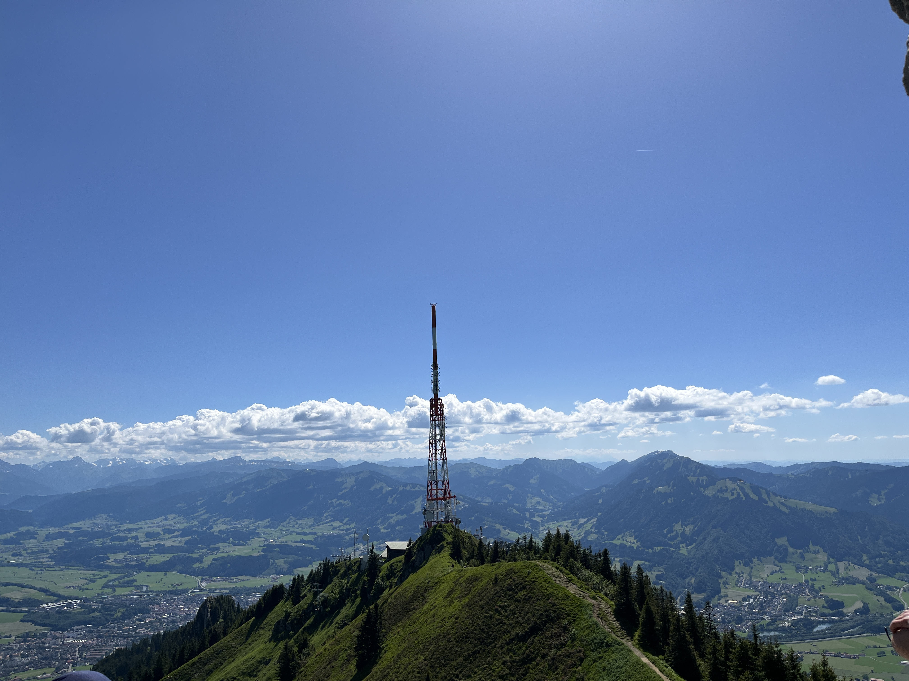

# Auf den Grünten und über die Starzlachklamm zurück

## Übersicht

Die beschriebene Wanderung startet in _Burgberg_ bei Sonthofen, führt hoch vorbei am _Grüntenhaus_ zum Grünten mit wunderbarem Blick über das Allgäu. Der Abstieg erfolgt dann über die Starzlachklamm und endet am Bahnhof in Sonthofen.

Mit 19 km und rund 1000 Höhenmetern eine tagesfüllende Tour, man sollte also nicht zu spät losfahren. Technisch ist sie aber einfach (SAC T1/T2 ohne abschüssige Stellen).

**Start:** Burgberg, Ortsmitte (Linie 11) \
**Ende:** Sonthofen Bahnhof

## Von Burgberg zum Grünten

Natürlich kann man die Wanderung auch am Blaichacher Bahnhof starten, angesichts der Tatsache, dass sie mit 19 km eh schon relativ lang ist, habe ich aber darauf verzichtet und die Busverbindung nach _Burgberg_ gerne angenommen, zumal die Fahrpläne ganz gut auf die Regionalzüge abgestimmt sind.

{ width=80% } \
_Umstieg auf den Bus im Bahnhof Immenstadt; Foto: Bernhard Walle_

Gleich am Anfang passiert man die Burgruine, von der der Ort „Burgberg“ wohl seinen Namen bekommen hat. Sie ist allerdings recht unspektakulär. Schöner ist da der Ausblick zurück auf das Dorf und die gegenüberliegenden Berge, und dann startet auch schon gleich der kontinuierliche Anstieg zum Grünten.

{ width=80% } \
_Burgruine; Foto: Bernhard Walle_

{ width=80% } \
_Blick auf Burgberg; Foto: Bernhard Walle_

Der Weg verläuft auf gut begehbaren Wegen, hier noch teilweise durch den Wald. Weiter oben beim Grüntenhaus begegnen uns Kühe, die einen gerne vorbeilassen und oben sieht man auch schon den unverkennbaren Sendemast als Etappenziel.

Es lohnt immer mal wieder der Blick zurück, da wir ja beim Abstieg einen komplett anderen Weg durch die Klamm gehen und so eine andere Perspektive haben werden.

{ width=80% } \
_Grüntenhaus und wunderbarer Ausblick; Foto: Bernhard Walle_

Oben angekommen kommt man erstmal an den gigantischen Sendeanlagen des Bayerischen Rundfunks vorbei. Der Sendeturm ist 94,5 m hoch. Ursprünglich 1951 errichtet, damals noch 38 m hoch, wurde er 1994 aufgestockt. Durch die exponierte Lage des Grünten – weshalb er auch als „Wächter des Allgäus“ bezeichnet wird – versorgt der Grundnetzsender den südlichen Teil des Regierungsbezirks Schwaben in Bayern und weite Teile der Region Bodensee-Oberschwaben in Baden-Württemberg mit Hörfunk und Fernsehen. Mehr Informationen finden sich auf [Wikipedia: „Sender Grünten“](https://de.wikipedia.org/wiki/Sender_Gr%C3%BCnten).

Die Seilbahn, die _Grüntenbahn_, wird aktuell ausschließlich zur Versorgung des Senders benutzt, der öffentliche Fahrbetrieb wurde 2014 eingestellt. 

{ width=80% } \
_Richtfunksender mit Ausblick auf das Allgäu; Foto: Bernhard Walle_

Vom Sender ist es noch ein kleines Stück zum _Jägerdenkmal,_ welches man von der Ferne am besten ablichten kann. Dort lohnt sich dann auch eine kleine Pause, aber Achtung: bei schönem Wetter ist man hier nicht unbedingt alleine. Der Grünten ist ein beliebtes Ziel. Ich persönlich empfand es aber jetzt auch nicht als „überlaufen“ sondern durchaus noch angenehm.

{ width=80% } \
_Jägerdenkmal am Grünten; Foto: Bernhard Walle_

Vor allem sollte man die wirklich wunderbare Aussicht in alle Richtungen genießen.

{ width=80% } \
_Ausblick nach Norden; Foto: Bernhard Walle_

{ width=80% } \
_Sendemast des Senders „Grünten“; Foto: Bernhard Walle_

## Vom Grünten zur Starzlachklamm

Langsam beginnt der Abstieg, erst setzen wir die Richtung einfach fort und der Weg ist auch noch relativ breit. Der Ausblick bleibt traumhaft.

{ width=80% } \
_Abstieg vom Grünten; Foto: Bernhard Walle_

Schließlich wechseln wir die Richtung nach rechts, der Weg wird deutlich schmaler, wir kommen an einem Felsen vorbei. 

{ width=80% } \
_Fels mit Rastbank; Foto: Bernhard Walle_

Danach wird es aber auch schon wieder breiter, teilweise geht es dann über den Fahrweg und überraschenderweise kommen wir sogar noch an einer kleinen Alm vorbei, wo man Getränke verkauft. Die Stärkung sollte man auch annehmen, denn bis zum Bahnhof ist es noch ein längerer Weg!

{ width=80% } \
_Alm; Foto: Bernhard Walle_

Der letzte Teil bis zur Klamm besteht dann aus Stufen, aber man hört schon das Rauschen des Wassers, weit kann es also nicht mehr sein!

{ width=80% } \
_Stufen runter zur Klamm; Foto: Bernhard Walle_

## Durch die Starzlachklamm nach Sonthofen

Die Mühen wurden belohnt wie man auf den Bildern sieht:

{ width=80% } \
{ width=80% } \
_Starzlachklamm; Foto: Bernhard Walle_

Wie üblich geht man über einige Brücken und die Wege am Rande der Klamm sind gesichert. Insgesamt sehr ungefährlich wenngleich natürlich auch etwas rutschig. Aber da wir ja über den Berg gekommen sind, haben wir ordentliche Wanderschuhe. Zweiter Vorteil, die Klamm ans Ende der Wanderung zu packen: die ganzen Tagestouristen sind schon verschwunden und man hat hier mehr oder weniger seine Ruhe.

Streng genommen kann man sich dann auch den Eintritt am Ende beim Verlassen sparen. Aber da das Ganze aber ja Geld kostet, entscheide ich mich dennoch freiwillig, den Obolus in die Kasse zu werfen.

Weiter vorne wird die _Starzlachklamm_ dann zur _Starzlach_ (also einem normalen Bach bzw. Fluss).

{ width=80% } \
_Starzlach; Foto: Bernhard Walle_

Die Stimmung und das Licht am Abend ist heute phantastisch, der restliche Weg befindet sich dann einfach auf der wenig befahreren Straße.

{ width=80% } \
_Abendsonne Richtung Sonthofen; Foto: Bernhard Walle_

Nach dem Überqueren der Ostrach gibt es in der Innenstadt von _Sonthofen_ noch was zum Essen, bevor es mit dem Zug wieder zurück geht. Ein sehr schöner aber doch langer Tag geht zu Ende. Es war einer meiner schönsten Berg-Tagestouren überhaupt.

{ width=80% } \
_Überquerung der Ostrach; Foto: Bernhard Walle_

{ width=80% } \
_Warten am Bahnhof auf den Zug; Foto: Bernhard Walle_
