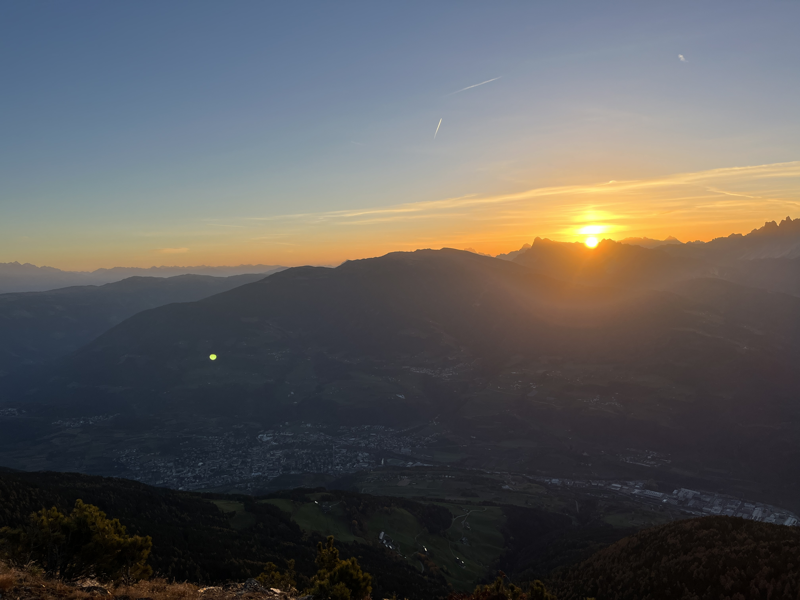

# Zweitagestour zur Radlseehütte

## Übersicht

Eine wunderschöne Zwei-Tages-Wanderung in Südtirol in den Sarntaler Alpen mit herrlichem Blick auf die Dolomiten. Einer meiner schönsten Zweitagestouren überhaupt.

Ich bin sie im Herbst 2022 Ende Oktober in den Allerheiligenferien gegangen. Das war das letzte Wochenende, an dem die Hütte noch offen hatte. Sicherlich ein außergewöhnliches Jahr, dennoch sollte man diese Wanderung gerade im Herbst im Blick haben, wenn die meisten anderen Hütten schon geschlossen sind oder eben im Frühjahr, wenn die anderen noch nicht geöffnet haben. Die Hütte hat normalerweise von Mai bis Ende Oktober geöffnet.

Nachdem ich in Nürnberg wohne, habe ich mir für die Anreise und Abreise jeweils einen Tag genommen und in Brixen übernachtet. Die Zugverbindungen von Österreich und Deutschland nach Brixen sind mit dem zweistündlichen RailJet über den Brenner (damals noch EuroCity) hervorragend.

Von Brixen gibt es zum Start bzw. vom Ziel eine gute Busverbindung, die man auf [Südtirolmobil](https://www.suedtirolmobil.info) findet.

**Start:** Feldthurns (Bushaltestelle)

**Ziel:** Latzfons (Bushaltestelle)

**Schwierigkeit:** einfach bis mittel (SAC T2)

## Von Feldthurns zum Radlsee und zur Radlseehütte

Der Tag beginnt nach einer kurzen Busfahrt in der kleinen Gemeinde [Feldthurns](https://de.wikipedia.org/wiki/Feldthurns) im Eisacktal. An diesem Tag war eine Veranstaltung im Ort, so dass der Bus nur bis zur Haltestelle außerhalb fuhr. Von dort geht man geradeaus, vorbei am Schloss auf der linken Seite. Sofort fällt der „schiefe Turm“ der Kirche ins Auge:

{ width=80% } \
_St. Laurentiuskirche in Feldthurns; Foto: Bernhard Walle_

Weiter geradeaus bis zur Kapelle, dort geht man dann rechts und folgt dem Wanderweg.

{ width=80% } \
_Kapelle St. Antonius in Feldthurns; Foto: Bernhard Walle_

Zunächst läuft man auf der Straße weiter hoch nach _Schnellen_ und weiter, vorbei an ein paar Höfen. Schon dort hat man einen herrlichen Ausblick.

{ width=80% }\
_Ausblick auf den Rosengarten; Foto: Bernhard Walle_

Nun verlässt man die Straße und geht links weiter auf einem Forstweg hoch. Man passiert das Dorf _Garn,_ vorbei an der Kirche mit Friedhof. Bis hierhin könnte man auch den Bus nehmen, falls man die Tour kürzer gestalten möchte.

Weiter geht's durch den wunderbar herbstlichen Wald und über Wiesen. Wirklich nach „Gebirge“ fühlt es sich noch nicht an, auch wenn es viele Höhenmeter werden und man einen schönen Ausblick auf die Berge hat. Immerhin liegt das Ziel auf 2.284 m.

{ width=80% }\
_Waldweg; Foto: Bernhard Walle_

{ width=80% }\
_Beschilderung zum Radlsee; Foto: Bernhard Walle_

Der _Radlsee_ hat übrigens nichts mit Fahrrädern zu tun. Der Name kommt aus der Sagenwelt: Angeblich hat man ein Radl in den See hineingeworf und es ist im Durnholzer See aufgegangen. In Durnholz hat man der Legende nach einmal einen schwarzen Bock in den See geworfen, und oben im Radlsee gingen die Hörner auf.

Langsam passiert man die Baumgrenze.

{ width=80% }\
_Links die Glanger Kas Alm und Ausblick; Foto: Bernhard Walle_

Der Weg führt weiter nach oben, man geht kurz über einen wieder breiteren Forstweg wo man vielen Mountainbikes begegnet und sich eine kleine Schutzhütte befindet. Dann wieder rechts auf einen schmaleren Wanderweg und langsam sieht man auch die Hütte und den See schon.

{ width=80% }\
_Wanderweg zum Radlsee; Foto: Bernhard Walle_

Geschafft! Es sind noch viele Tagesausflügler da, aber es wird ruhiger werden. An diesem Tag übernachten dann nur um die zehn Gäste, in meinem Zimmer/Lager sind lediglich vier Betten belegt.

{ width=80% }\
_Radlsee; Foto: Bernhard Walle_

Ich bin gut in der Zeit, es ist um 15 Uhr. Ich checke erstmal ein, esse noch einen Kuchen und nutze die Zeit zum Fotografieren und um den herrlichen Blick über das Eisacktal und Brixen zu genießen. Die Sonne geht Ende Oktober ja auch schon früh unter, es ist Sonntag nach der Zeitumstellung.

{ width=80% }\
_Eingecheckt; Foto: Bernhard Walle_

{ width=80% }\
_Blick über Brixen und das Eisacktal; Foto: Bernhard Walle_

{ width=80% }\
_Blick in die andere Richtung; Foto: Bernhard Walle_

{ width=80% }\
_Radlsee und -hütte im Sonnenuntergang; Foto: Bernhard Walle_

Jetzt ist es ruhig hier oben. Eigentlich genau das, warum ich gerne auf dem Berg übernachte. Ich mag die Ruhe. Ich finde das viel angenehmer als nach einer Bergtour ins Tal abzusteigen wo man leider häufig durch den Verkehr und die Schallreflexionen mehr Lärm hat als zu Hause im Wohngebiet.

Das hektische Treiben auf den Hütten mag ich eher weniger, daher bin ich dann bevorzugt draußen und mag lieber kleinere Hütten oder gehe zu Zeiten wo weniger los ist. Deshalb war das mit dem Allerheiligen-Wochenende auch so perfekt.

## Von der Radlseehütte über die Klausner Hütte nach Latzfons

Ein großer Vorteil wenn man Ende Oktober auf einer Hütte übernachtet: man kann den Sonnenaufgang genießen ohne mitten in der Nacht aufstehen zu müssen. Dieses Foto ist um 7:02 Uhr kurz vor dem Frühstück entstanden. Zugegeben wäre es einen Tag davor wegen der Zeitumstellung noch entspannter gewesen.

{ width=80% }\
_Sonnenaufgang auf der Radlseehütte; Foto: Bernhard Walle_

Während des Frühstücks ergibt sich noch ein witziges Gespräch zwischen anderen Gästen und mir, nämlich dass die Leute ein Nischenprodukt meiner Firma (Verkaufszahl so im einstelligen Tausender-Bereich) verwenden, das ich maßgeblich entwickelt hatte. So klein kann die Welt sein dass man solche Leute ausgerechnet auf einer Berghütte in Südtirol trifft.

Ich steige jetzt hinter der Hütte (also nicht in Richtung Eisacktal, wo die ganzen Bilder entstanden sind) hoch. Es geht zunächst über einen Grat, der aber sehr unschwierig ist und auch für Angsthasen wie mich kein Problem darstellt.

Trotzdem habe ich einen folgenschweren Fehler gemacht: kein Proviant mitgenommen. Ich hatte die _Klausner Hütte_ als Mittagessen einkalkuliert, die aber schon geschlossen war. Mehr als ein Müsliriegel blieb also nicht für den ganzen Tag. Viele machen das ja immer so und frühstücken viel, mich macht ein ausgiebiges Frühstück eher träge, ich brauch da ein Lunchpaket wenn es unterwegs nichts gibt.

{ width=80% }\
_Blick von oben auf Radlsee und -hütte; Foto: Bernhard Walle_

{ width=80% }\
_Weg auf dem „Grat“; Foto: Bernhard Walle_

Der zweite Fehler heute: ich folge nicht meiner ursprünglichen Planung sondern dem Rat von anderen Leuten und gehe zunächst zur _Fortschellscharte_ und will von dort zum _Latzfonser Kreuz_. Ein Fehler deshalb weil kurz vor dem Latzfonser Kreuz ein relativ schmaler, zwar seilversicherter aber auf der anderen Seite steil nach unten abfallender Weg folgt, der für meine Höhenangst schwer überwindbar ist.

Ich kehre daher um. Der GPS-Track ist aber nachbearbeitet und die Stelle, wo ich dann zurückgelaufen bin, fehlt. Es geht erst zur Fortschellscharte und von dort zur _Klausner Hütte_. Im Prinzip kann man auch direkt vor der Scharte runter zur _Klausner Hütte_ laufen ohne den „Knick“.

{ width=80% }\
_Ausblick; Foto: Bernhard Walle_

{ width=80% }\
_Blick auf die Klausner Hütte; Foto: Bernhard Walle_

{ width=80% }\
_Klausner Hütte; Foto: Bernhard Walle_

Dass die Hütte geschlossen ist, merke ich natürlich erst jetzt. Es ist schon 14 Uhr, ich bin hungrig und will im Prinzip einfach nur ins Dorf. Zum Glück ist der Weg ab jetzt auch sehr einfach, ein reiner Forstweg der irgendwann in eine Straße mündet.

{ width=80% }\
_Straße; Foto: Bernhard Walle_

In Latzfons finde ich dann auch einen kleinen Laden, der was zu essen verkauft. Jetzt also nur noch auf den Bus warten. Es wird langsam dunkel. Bei dem Ausblick macht das Warten auf den Bus aber trotzdem Spaß.

{ width=80% }\
_Kirche in Latzfons; Foto: Bernhard Walle_

{ width=80% }\
_Blick von der Bushaltestelle; Foto: Bernhard Walle_

Auch wenn an dem Tag nicht alles perfekt gelaufen ist, die zwei Tage waren wunderschön und eines der Bilder, die entstanden sind, ist heute noch eines meiner Hintergrundbilder auf meinem Desktop.
